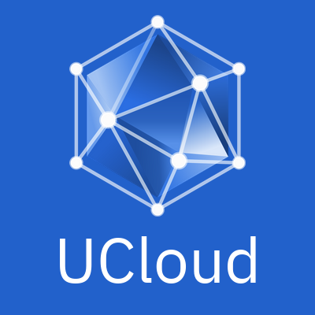
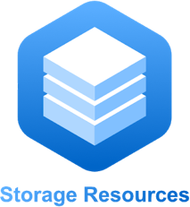

# UCloud Developer Guide



UCloud is a digital research environment. It provides an intuitive user interface that improves the usability HPC
environments or other computing environments such as Kubernetes clusters. UCloud provides a way to access and run
[applications](#applications) regardless of users’ location and devices. It also serves as a cloud
[data storage](#storage), which allows users to analyse and share their data.

In a sense, UCloud acts as an orchestrator of resources. Allowing users to consume resources, such as compute and
storage, from multiple different providers using the same interface. This allows for seamless experience when consuming
resources from different providers, allowing researchers to focus on their work as opposed to the specifics of any given
provider.

This document covers UCloud from a developer's perspective. __The end-user guide for UCloud can be
found [here](https://docs.cloud.sdu.dk/user/)__.

## Quick-Start

UCloud can be started using the built-in launcher:

```
./launcher
```

[](https://asciinema.org/a/416123)

## Storage



UCloud provides storage resources to users in the form of a file system. This file system provides familiar operations
on data to end-users. The file system allows, e.g., users to read and write folders and files. Access to the file system
is provided through a common API interface which enforces data management constraints and auditing.

UCloud offers a variety of features built on top of the storage, including:

- [Accounting](./docs/developer-guide/accounting-and-projects/accounting/wallets.md)
- [Data management features](./docs/developer-guide/orchestration/storage/metadata/templates.md)
  - [Favorite files](./docs/developer-guide/orchestration/storage/metadata/templates.md)
  - [Explicit tagging of file sensitivity](./docs/developer-guide/orchestration/storage/metadata/templates.md)
- [Permission management](./docs/developer-guide/orchestration/resources.md)
- [Indexing and Search](./docs/developer-guide/built-in-provider/storage/files.md)

## Collaboration

Users are able to share the files they own with other users. For larger
collaborations, UCloud provides the possibility to create projects for research
collaborations between users. Users of a project have one shared workspace which all collaborators can access. This
workspace provides access to storage and compute resources. PIs and administrators of a project can tweak the permission
of individual users as well as groups.

## Applications


UCloud allows users to pick from a selection of applications in the platform.
The collection of applications will depend on the provider(s) that a user has access to. UCloud supports both
applications that run in batch mode and interactive mode. UCloud
can orchestrate to any provider which support the
provider API.

Applications can consume the files that are located in UCloud as input data. Once an app has finished, the output files
in the "work" folder are available in the UCloud file system.

Just as with the storage, UCloud keeps an account of the compute time used. A
user can see, via the web app, how much compute time they have used on UCloud for any given time period. Again, it is
possible to create reports if billing is needed.

Tools and applications, in UCloud, are defined using YAML documents. The tools describe which container image should be
used by the apps associated to the tool. The app YAML document describes how the tool should be invoked and the
necessary parameters. For more details on the tool and app format see:

- [Tools](./docs/developer-guide/orchestration/compute/appstore/tools.md)
- [Applications](./docs/developer-guide/orchestration/compute/appstore/apps.md)

## Suggested Reading

- [End-user Documentation](https://docs.cloud.sdu.dk/user/)
