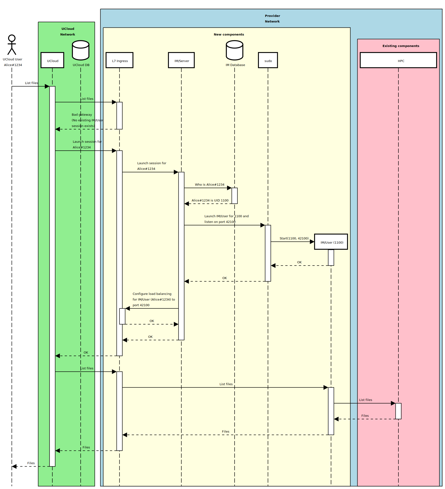

# UCloud Integration Module

In this document, we will provide an overview of how the integration module (IM) of UCloud works. This document will
only provide an overview. We encourage that you read up on the related concepts.

## High-level architecture

At a high-level, an integration module deployment consists of a few different components:

Below, we summarize the components, their role and their special privileges.

| Component    | Run as (User)        | Notes                                                               | Extra privileges                                           |
|:-------------|:---------------------|:--------------------------------------------------------------------|:-----------------------------------------------------------|
| `L7 Ingress` | `ucloud`             | Load balancer of HTTP traffic                                       | None (Certain configs will require `CAP_NET_BIND_SERVICE`) |
| `IM/Server`  | `ucloud`             | The integration module server                                       | Able to launch IM/User instances (through `sudo`)          |
| `IM/User`    | End-user (see notes) | Accepts requests that need to run in the context of a specific user | None                                                       |

## External communication and authentication

The integration module receives all traffic through an HTTPS and WebSocket API. The module listens on a configurable
interface on a configurable port (pending #3270). It is not currently possible to bind to a privileged port (< 1024)
since the IM refuses to launch as root.

The full API documentation, including the provider APIs implemented by the integratino module, is available here:
https://docs.cloud.sdu.dk/dev/index.html.

UCloud requires TLS from all providers running in a production environment. The certificate must be valid and signed by
a recognized Certificate Authority (CA). We encourage providers to follow best practices. For inspiration, Mozilla
hosts an online [SSL configuration generator](https://ssl-config.mozilla.org). Additionally, [this document
(https://github.com/ssllabs/research/wiki/SSL-and-TLS Deployment-Best-Practices) from SSL Labs can provide a good
starting point.

Most communication received by the provider is coming directly from UCloud. In some cases the integration module will
receive communication directly from the end-user. This is the case for uploads, downloads and other interactive
applications.

UCloud uses three different mechanisms for authenticating communication:

1. Through TLS certificates. This applies to outgoing communication in both directions between UCloud and the provider.

2. Through JSON Web Tokens (JWT). This applies to incoming communication in both directions between UCloud and the
provider. More information can be found [here](../backend/auth-service/README.md).

3. Through short-lived one-time tokens. This applies only to communication between the end-user and provider. An
example can be found [here](https://docs.cloud.sdu.dk/dev/docs/developer-guide/orchestration/compute/jobs.html#example-starting-an-interactive-terminal-session).

## Internal communication and authentication

The IM/User and IM/Server instances bind to ports starting at 42,000 on the loop-back interface (pending #3271). These
instances receive traffic only from the L7 ingress. The L7 ingress does not change the request semantics. It is only
responsible for forwarding the traffic to the correct instance. The IM instances verify all authentication tokens them
selves.

An IM/User instance can communicate with an IM/Server instance through IPC. The integration module implements
inter-process communication through a unix socket. The IM/Server creates the socket at `/var/run/ucloud/ucloud.sock`.
The socket is set to be usable by all users and communication. The server uses the authentication mechanisms of the
kernel (i.e. UID, GID and PID through `SO_PEERCRED`). 

## Authorization

The integration module re-uses the authorization mechanisms already in place at the HPC system. The IM/User instances
handle user-generated traffic. The instances which receives the traffic of a user, always runs as their own user on the
system. As a result, the IM/User instance is only capable of performing operations which the user can perform.

On top of this, UCloud also performs authorization before forwarding requests. You can read more about this step [here]
(https://docs.cloud.sdu.dk/dev/docs/developer-guide/accounting-and-projects/providers.html).

## Launching IM/User instances

NOTE: To limit the scope we recommend only granting limited access to sudo from the `ucloud` service user.

## Creating a mapping between UCloud users and local users

TODO

## Independant verification of user requests

---

__📝 NOTE:__ Very informal draft.

---

Some quick thoughts about how we can extend the protocol to support verification of the client sending the message. This
is extremely useful as it would make UCloud incapable of impersonating a user at a different provider.

1. Extend client-side RPC to include a signature of their message
   - This message should use public-private keypairs
   - Keypairs are generated in the browser
   - The public key is transferred to the provider _by_ the user
   - This will happen when the user connects to the provider
   - Possible library: https://github.com/kjur/jsrsasign
   - This will support keygen and signature we need
   - The signature should be passed in a header
2. UCloud receives this message, and extends it with additional information
3. UCloud includes, verbatim, the original request along with the signature
   - How do we make this developer friendly?
4. Provider verifies that the JWT is valid (by UCloud)   
5. Provider verifies that the original request has been signed
5. Provider verifies that the original request _also_ matches the additional context that UCloud provided

A possible alternative to signing the entire message is to sign a JWT (or any other document, we don't really need the
header). This JWT would provide similar security, the document should contain:

- `iat`: Issued at
- `exp`: Expires at
- `sub`: Username (UCloud)
- `project`: Project (UCloud)
- `callName`: Potentially, this could contain the name of the call we are performing. This would allow the provider to
   verify that the correct call is also being made.
